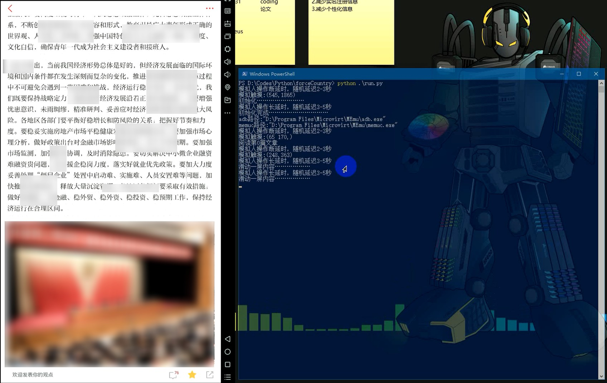

# 写在最前面

## Python

### 让机器自己学习相关重要讲话精神，你已经快毕业了，要会自己学习

---

## 恢复更新

* 2019-03-06
  * 因积分要求变动，此项目恢复更新
  * 本次更新计划：在原计划基础上增加Android积分助手，有利于身边没有电脑的小伙伴提升使用体验
  * 由于要参加春招，Android积分助手将会延期上线，请谅解

---  

## 暂停更新

    因为要求每周15积分，现有积分规则可以轻易满足，因此暂停更新。

## 更新

* 2019-01-28
  * 通过搜索指定订阅号搜索文章，提高精度
* 2019-01-27
  * 切换文章源，新华社文章

---

## 初步分两期完成

* 第一期  

    简单内容，完成模拟操作，减少精力耗费

* 第二期  

    加入图像识别，做到程序能自己读题、理解题意，然后完成相应测试题

---

## 配置环境  

1. Python3.7  
2. 虚拟机：逍遥安卓模拟器 V6.0.7  
    * 分辨率设为1920×1080、竖屏，所有配置全部按照1920×1080、288PPI
3. 系统：Windows 10  
    * 跨平台不支持，后面有时间会考虑集成Google原生Android镜像做成跨平台  
    * 其他Windows版本未测试，有问题提Issues

* 其他没说到的问题，有疑问提Issues。有时间就回答。  

---  

## 截图

  

### 备注

没想好说什么